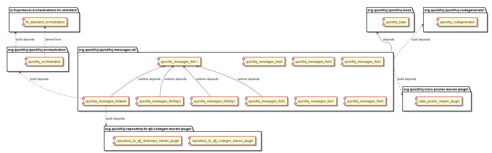
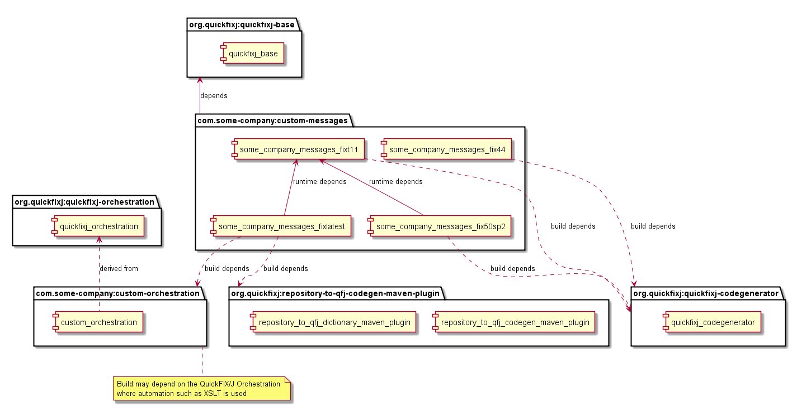

# QuickFIX/J Messages

## How the build is organised

This module builds artefacts for the standard published FIX specification versions from FIX 4.0 to FIX Latest. 

* ```quickfixj-messages-all``` - generates sources for and compiles classes for all of FIX Protcol versions
* ```quickfixj-messages-fixlatest```
* ```quickfixj-messages-fixt11```
* ```quickfixj-messages-fix50sp2```
* ```quickfixj-messages-fix50sp1```
* ```quickfixj-messages-fix50```
* ```quickfixj-messages-fix44```
* ```quickfixj-messages-fix43```
* ```quickfixj-messages-fix42```
* ```quickfixj-messages-fix41```
* ```quickfixj-messages-fix40```

QuickFIX/J core is agnostic to FIX Protocol specification versions. It is designed to support multiple concurrent versions at run time. 

Messages and Components are effectively compositions of ```Maps``` of ```quickfix.Fields```.
The Messages and Components are in distinct packages for the FIX protocol versions. A result of this design is that the ```quickfix.Fields``` package is common to all the FIX protocol version packages. By and large the more recent versions are super-sets of the Fields of prior versions.

The generated Fields, Components and Messages depend on packages provided by ```quickfixj-base```. Some Standard Header and Trailer ```quickfix.Fields``` are provided by  ```quickfixj-base```. These fields are removed from the generated code before assembly to avoid conflicts with those provided by ```quickfixj-base```.

Implementations for FIX versions from **FIX4.0 to FIX5.0sp2 and for FIXT1.1** are generated from the QuickFIX dictionaries for the specific version. The dictionaries are located in the ```src/main/resources``` directory of the respective modules of the ```quickfixj-messages``` module.

Implementations for **FIX Latest** are generated from a [FIX Orchestra](https://www.fixtrading.org/standards/fix-orchestra/) "repository" file. An implementation based on the FIX Orchestra standard is known as an "orchestration". The official standard FIX Orchestra repository requires some modification to work well with QuickFIX/J. This is done by the [```quickfixj-orchestration```](../quickfixj-orchestration/readme.md) module. The code generation for FIX Latest depends on the orchestration published by the ```quickfixj-orchestration``` module.

The code generation for the FIX Protocol specification versions is done in thr ```quickfixj-messages-all``` module. It proceeds in order from oldest to most recent (latest), with the class generated from most recent specification of a Field over-writing any prior classes. This behaviour can be controlled using the ```overwrite``` parameter on the ```quickfixj-codegenerator``` maven plugin and by changing the order of processing.
Consequently, in the QuickFIX/J build, almost all the Field classes are those generated from the FIX Latest Orchestration. 

This scheme works well though in a few cases; the data type of the Field, with the same designated java class name, has changed between legacy versions. In these cases a choice needs to be made which data type to use. The QuickFIX/J project prefers the most recent specification of the field. In the unlikely event that a legacy version of a Field is required a custom build can be implemented. Please note that a legacy implementation of a Field cannot deterministically be used in the same Java runtime as an incompatible class of the same name.

[FIX Orchestra](https://www.fixtrading.org/standards/fix-orchestra/) and ***FIX Latest*** are designed to provide machine-readable Rules of Engagement and are intended for customisation. See "Recommendation on how to implement a custom build" below.

```quickfixj-messages-all``` generates the sources for all FIX Protocol versions and packages all the versions together. The other modules package the FIX Protocol specification versions independently. This is done in reverse order so that fields not present in older protocol versions can be pruned prior to packaging. This results in smaller packages and javadoc can be run without requiring excessively large heap size and build time.

It is not neccessary for an application to depend on ```quickfixj-messages-all```. An application may depend only the artefacts for the FIX Protocol versions that it requires. Please note that application using FIX Protocol versions **5.0 and later** will also depend on ```quickfixj-messages-fixt11```. This provides the implementation for the FIXT1.1 Transport messages.

## Techniques to customise a build

* Omit FIX Protocol versions that are not required
* For versions prior to FIX Latest, edit the QuickFIX Dictionary to control code generation
* For FIX Latest, edit the FIX Orchestra Repository (Orchestration) to control code generation
* Manipulate the order of code generation and/or the "over-write" behaviour of code generation
* Choose whether to use ```Double``` or ```BigDecimal``` for FIX "Decimal" Data Types 

## Tools to customise a build
* The [```quickfixj-orchestration```](../quickfixj-orchestration/readme.md) module publishes a FIX Latest orchestration that is QuickFIX/J compatible. This can serve as a foundation for a custom Orchestration. N.B. There is also an orchestration for FIX4.2 and FIX4.4.
* This project publishes the ```quickfixj-codegenerator``` maven plug-in used to generate FIX Field, Component and Message sources from a QuickFIX Dictionary. 
* This project publishes the [```repository-to-quickfixj```](../repository-to-quickfixj-parent/readme.md) artefacts used to:  
  * ```repository-to-qfj-codegen-maven-plugin``` generates FIX Field, Component and Message sources directly from a FIX Orchestration. 
  * ```repository-to-qfj-dictionary-maven-plugin``` generates QuickFIX dictionaies from FIX Orchestrations. 
* This project publishes the [```class-pruner-maven-plugin```](../class-pruner-maven-plugin/readme.md) that can be used to delete (generated) sources and classes that are not present in provieded QuickFIX Dictionaries. This is a very specialised plug-in and is not expected to be needed for custom builds, see recommendations below.

These tools should facilitate building custom Fields, Components and Message packages without needing to maintain a customised Fork of the entire QuickFIX/J project for this purpose. This allows decoupling of a custom build for the Fields, Components and Message from the QuickFIX/J build.

## Recommendation on how to implement a custom build

The artefacts created by the ```quickfij-messages``` module are <u>**test**</u> dependendencies of ```quickfixj-core```. They are not specified as _runtime_ dependencies, which makes it easier to customise QuickFIX/J deployments. Application that depend on ```quickfixj-core```  will need to include artefacts containing Field, Component and Message packages  as **compile** or **runtime** dependencies.

Artefacts for unused FIX specification versions can be omitted from your runtime and it is not neccessary to build artefacts that are not used. Please note, if using the artefacts from this build, applications using FIX Protocol verisions 5.0 and later will also depend on ```quickfixj-messages-fixt11```. This provides the implementation for the FIXT1.1 transport messages.

A custom build can provide custom artefacts for the required Fields, Component and Message. The QuickFIX/J project can supply  ```quickfixj-core``` and tools.

**Custom builds must provide all the Fields, Components and Messages excluding those few Fields provided by ```quickfixj-base```.**  This avoids ambiguity, conflicts (*package name space collisions*) and jvm class verification exceptions. At run time the Components and Messages must use the Fields against which they have been compiled. Message artefacts from the QuickFIX/J project cannot be mixed with custom distributions but ```quickfixj-core```, ```quickfixj-base``` and tools can be used by dependent applications and builds.

One way to start a custom build this is to copying this maven module, or only ```quickfixj-messages-all```, into an independent build. If doing so:
* The Maven ```groupId```s should be changed (it's not neccessary nor desirable to use ```org.quickfixj``` for custom distributions). The ```version```s and ```artefactId```s may likewise be changed. Artefacts can then be published to public maven repositories as long as the QuickFIX/J ```groupId``` is not used. 
* Ensure the QuickFIX Software Licence is included in the distribution. It can be found in the root of this project.
* Modules and directories for FIX Protcol versions that are not required can be removed. The ```quickfixj-messages-all``` contains the code generation. If removing unused FIX protocol versions then this module will need to be edited to omit these versions.
* The structure of these modules can be refactored to meet your requirements. This build has a complex structure to normalise the ```quickfixj-messages-all``` into a set of more minimal artefacts for specific FIX versions. This complexity should be unneccesary for more specialised and compact Rules of Enagement. A practical approach is to remove unneccessary dependencies from ```quickfixj-messages-all``` and build a single artefact per Rules of Engagement. This artefact can have a new ```groupId``` and ```artefactId``` as aforementioned.
* FIX versions **FIX4.0 to FIX5.0sp2 and for FIXT1.1**
  * Edit the QuickFIX dictionary for the FIX protocol version that you are customising. The dictionary is found in ```/src/main/resources``` directory of the module corresponding to the FIX protocol version.
* FIX Latest:
  * The [```quickfixj-orchestration```](../quickfixj-orchestration/readme.md) module publishes a FIX Latest orchestration that is QuickFIX/J compatible. This can be a starting point for customisation. Please note that this is a complete representation of the FIX Latest specification and results in a very large distribution.The purpose of [FIX Orchestra](https://www.fixtrading.org/standards/fix-orchestra/) is to provide a machine-readable Rules of Engagement so sustomisation is expected. See [```quickfixj-orchestration```](../quickfixj-orchestration/readme.md) for references to [FIX Trading Community](https://www.fixtrading.org/) tools.
  * The custom orchestation should be used as the ```org.quickfixj:quickfixj-orchestration``` dependency for the custom build.
  * The ```quickfixj-messages-all``` maven build includes a ```minimal-fix-latest``` profile. The purpose of this is to minimise the FIX Latest packages in this profile. The minimal packages will include only those Fields, Componenents and Messages on which tests in the ```quickfixj-core``` module depend. This is done to reduce memory requirements so build steps can be run without OOM exceptions. This profile can serve as an example of customising an orchestration using xslt but is not required in a custom build and can be removed. A custom orchestration should be much smaller than the complete FIX Latest orchestration.

  ## QuickFIX/J Build Dependencies

  

  ## A Custom Build Dependencies

  
  
