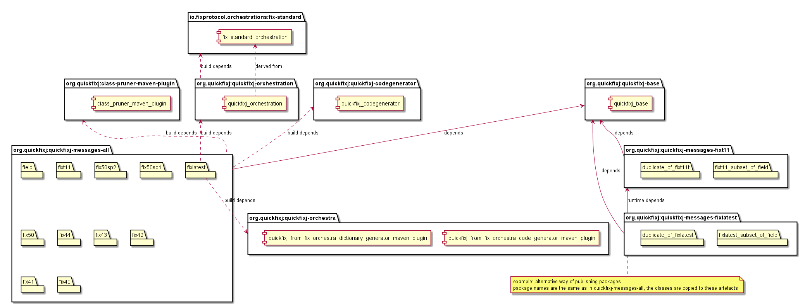
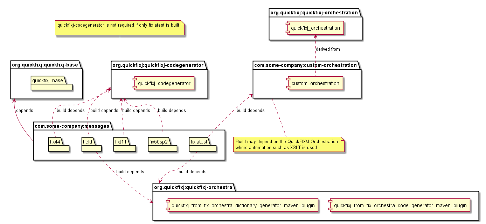

# QuickFIX/J Messages

## How the build is organised

This module builds artefacts for the standard published FIX specification versions from FIX 4.0 to FIX Latest. 

* ```quickfixj-messages-fixt11```
* ```quickfixj-messages-all``` - generates sources for and compiles classes for all of FIX Protcol versions
* ```quickfixj-messages-fixlatest```
* ```quickfixj-messages-fix50sp2```
* ```quickfixj-messages-fix50sp1```
* ```quickfixj-messages-fix50```
* ```quickfixj-messages-fix44```
* ```quickfixj-messages-fix43```
* ```quickfixj-messages-fix42```
* ```quickfixj-messages-fix41```
* ```quickfixj-messages-fix40```

QuickFIX/J core is agnostic to FIX Protocol specification versions. It is designed to support multiple concurrent versions at run time. 

Messages and Components are effectively compositions of ```Maps``` of ```quickfix.Fields```.
The Messages and Components are in distinct packages for the FIX protocol versions. 
A result of this design is that the ```quickfix.Fields``` package is common to all the FIX protocol version packages. 
By and large the more recent versions are super-sets of the Fields of prior versions.

The generated Fields, Components and Messages depend on packages provided by ```quickfixj-base```. 
Some Standard Header and Trailer ```quickfix.Fields``` are provided by  ```quickfixj-base```. 
These fields are removed from the generated code for other artefacts before assembly to avoid conflicts with those provided by ```quickfixj-base```.

In the QuickFIX/J build, implementations for FIX versions from **FIX4.0 to FIX5.0sp2** are generated from the QuickFIX dictionaries for the specific version. 
The dictionaries are located in the ```src/main/resources``` directory of the respective modules of the ```quickfixj-messages``` module.

In the QuickFIX/J build, implementations for **FIX Latest** and **FIX T1.1** are generated from a [FIX Orchestra](https://www.fixtrading.org/standards/fix-orchestra/) "repository" file. The official standard FIX Orchestra repository requires some modification to work well with QuickFIX/J. This is done by the [```quickfixj-orchestration```](../quickfixj-orchestration/readme.md) module. An implementation based on the FIX Orchestra standard is known as an "orchestration". 
The code generation for FIX Latest and FIX T1.1 depends on the orchestration published by the ```quickfixj-orchestration``` module.

The code generation for the FIX Protocol specification versions is done in the ```quickfixj-messages-all``` module. 
It proceeds in order from oldest to most recent (latest), with the class generated from most recent specification of a Field over-writing any prior classes. 
This behaviour can be controlled using the ```overwrite``` parameter on the ```quickfixj-codegenerator``` maven plugin and by changing the order of processing.
Consequently, in the QuickFIX/J build, almost all the Field classes are those generated from the FIX Latest Orchestration. 

This scheme works well though in a few cases the data type of a Field, with the same designated java class name, has changed between legacy versions.
In these cases a choice needs to be made which data type to use. 
The QuickFIX/J project build prefers the most recent specification of the field. The Field class generated from most recent specification will overwrite the Field generated from the obsolete specification. 
In the unlikely event that a legacy version of a Field is required, a custom build can be implemented. 
Please note that a legacy implementation of a Field cannot deterministically be used in the same Java runtime as an incompatible class with the same name (provided by a different jar)

[FIX Orchestra](https://www.fixtrading.org/standards/fix-orchestra/) and ***FIX Latest*** are designed to provide machine-readable Rules of Engagement and are intended for customisation. 
See "Recommendation on how to implement a custom build" below.

```quickfixj-messages-all``` generates (or imports) the sources for all FIX Protocol versions and packages all the versions versions together. 
The other modules package the FIX Protocol specification versions independently. 
The packaging is done in reverse order so that Fields not present in older versions of the FIX protocol versions can be pruned prior to packaging. 
This results in smaller, concise distributions and quicker build times.

It is not necessary for an application to depend on ```quickfixj-messages-all```. 
An application need only depend on the artefacts for the FIX Protocol versions that it requires. 
Please note that if using the conventional QuickFIX/J build, an application using FIX Protocol versions **5.0 and later** will also depend on ```quickfixj-messages-fixt11```. 
This package provides the FIXT1.1 Transport classes.

## Tools to use in a custom build
* The [```quickfixj-orchestration```](../quickfixj-orchestration/readme.md) module publishes a FIX Latest orchestration that is QuickFIX/J compatible. 
This can serve as a foundation for a custom Orchestration. **N.B.** 
There is also an orchestration available for FIX4.2 and FIX4.4, but the QuickFIX/J project does not employ these resources.
QuickFIX/J uses the legacy QuickFIX Dictionaries for greater legacy compatibility. 
* This project publishes the legacy ```quickfixj-codegenerator``` maven plug-in used to generate FIX Field, Component and Message sources from a QuickFIX Dictionary. 
* This project depends on the [```quickfixj-orchestra```](https://github.com/quickfix-j/quickfixj-orchestra) artefacts used to:  
  * ```quickfixj-from-fix-orchestra-code-generator-maven-plugin``` generates FIX Field, Component and Message sources directly from a FIX Orchestration. 
  * ```quickfixj-from-fix-orchestra-dictionary-generator-maven-plugin``` generates QuickFIX compatible dictionaries from FIX Orchestrations. 
* This project publishes the [```class-pruner-maven-plugin```](../class-pruner-maven-plugin/readme.md) that can be used to delete (generated) sources and classes that are not present in provided QuickFIX Dictionaries. 
This is a very specialised plug-in and is not expected to be needed for custom builds, see recommendations below.

These tools should facilitate building custom Fields, Components and Message packages without needing to maintain a customised Fork of the entire QuickFIX/J project for this purpose. This a custom build for the Fields, Components and Message to be implemented that is decoupled from the QuickFIX/J build.

## Techniques to customise the generated code

* Omit FIX Protocol versions that are not required
* For versions prior to FIX Latest, edit the QuickFIX Dictionary to control code generation.  
  * **N.B.** [FIX Trading Community](https://www.fixtrading.org/) does publish repositories for FIX 4.2 and FIX 4.4 but these are not used by the QuickFIX/J build. These may be used as the basis of a custom build.
* For FIX Latest, edit the FIX Orchestra Repository (Orchestration) to customise code generation.
* Manipulate the order of code generation and/or the "over-write" behaviour of code generation
* Use features of the ```quickfixj-from-fix-orchestra-code-generator-maven-plugin``` (generates code from an orchestration) to :
  * Generate only Messages, Components and Fields used by the FIXT1.1 Session Layer [```generateOnlySession```]
  * Generate only Messages, Components and Fields used by the Application Layer [```excludeSession```]
  * Choose whether to generate FIXT1.1 Session Layer messages in the package ```quickfix.fixt11``` as in done by the conventional QuickFIX/J build [```generateFixt11Package```] 
* Choose how to package the generated artefacts
* Choose whether to use ```Double``` or ```BigDecimal``` for FIX "Decimal" Data Types
  * ```<decimal>${generator.decimal}</decimal>``` for ```quickfixj-codegenerator```
  * ```generateBigDecimal``` for ```quickfixj-from-fix-orchestra-code-generator-maven-plugin```

## Recommendation on how to implement a custom build

The artefacts created by the ```quickfixj-messages``` module are <u>**test**</u> dependendencies of ```quickfixj-core```. 
They are not specified as _compile_ or _runtime_ dependencies. This is intended to make it easier to customise QuickFIX/J deployments. 
**Applications** that depend on ```quickfixj-core```  will need to include artefacts containing Field, Component and Message packages  as **compile** or **runtime** dependencies.

Artefacts for unused FIX specification versions can be omitted from your runtime and it is not neccessary to build artefacts that are not used. 

**Please note**: In the conventions of the QuickFIX/J build, applications using FIX Protocol verisions 5.0 and later will also depend on a ```quickfixj-messages-fixt11``` jar. 
This provides the FIXT1.1 transport classes. 
The intention is that a custom build should not need to generate the FIXT1.1 classes and can depend on the ```org.quickfixj:quickfixj-messages-fixt11``` artefact. 
This convention is not mandatory. You may choose to package the FIXT1.1 classes in the same artefact as the Message and Field classes.

A custom build can provide custom artefacts for the required Fields, Component and Message. 
The QuickFIX/J project can supply  ```quickfixj-core```, its transitive dependency ```quickfixj-base``` and tools as described above.

**Custom builds must exclude those few ```quickfix.field```s provided by ```quickfixj-base```.**
This avoids ambiguity, conflicts (*package name space collisions*) and jvm class verification exceptions. 
At run time the Components and Messages must use the Fields against which they have been compiled. 

Use the same version of code and dictionary generators that are used by the QuickFIX/J version on which the application an build depends.

One way to start a custom build this is to **copying** this maven module, or only ```quickfixj-messages-all```, into an independent build. If doing so:
* The Maven ```groupId```s should be changed (it's not necessary nor desirable to use ```org.quickfixj``` for custom distributions). The ```version```s and ```artefactId```s may likewise be changed. Artefacts can then be published to public maven repositories as long as the QuickFIX/J ```groupId``` is not used. 
* Ensure the QuickFIX Software Licence and/or Apache 2 license is included in the distribution. It can be found in the root of this project and/or the [quickfixj-orchestra](https://github.com/quickfix-j/quickfixj-orchestra) project
* Modules and directories for FIX Protocol versions that are not required can be removed. The ```quickfixj-messages-all``` contains the code generation. If removing unused FIX protocol versions then the copy of this module will need to be edited to omit these versions.
* The structure of these modules can be refactored to meet your requirements. This build has a complex structure to normalise the ```quickfixj-messages-all``` into a set of more minimal artefacts for specific FIX versions. This complexity should be unneccesary for more specialised and compact Rules of Enagement. A practical approach is to remove unneccessary dependencies from ```quickfixj-messages-all``` and build a single artefact per Rules of Engagement. This artefact can have a new ```groupId``` and ```artefactId``` as aforementioned.
* FIX versions **FIX4.0 to FIX5.0sp2**
  * Edit the QuickFIX dictionary for the FIX protocol version that you are customising. The dictionary is found in ```/src/main/resources``` directory of the module corresponding to the FIX protocol version.
    * **N.B.** [FIX Trading Community](https://www.fixtrading.org/) does publish repositories for FIX 4.2 and FIX 4.4 but these are not used by the QuickFIX/J build. These may be used as the basis of a customised build.
* FIX Latest:
  * The [quickfixj-orchestration](../quickfixj-orchestration/readme.md) module publishes a QuickFIX/J compatible __FIX Latest__ orchestration as ```org.quickfixj:quickfixj-orchestration```. This can be a starting point for customisation. Please note that this is a complete representation of the FIX Latest specification and results in a very large distribution.The purpose of [FIX Orchestra](https://www.fixtrading.org/standards/fix-orchestra/) is to provide a machine-readable Rules of Engagement. __FIX Latest__ is a very large distribution so customisation is **expected**. 
See [quickfixj-orchestration](../quickfixj-orchestration/readme.md) for references to [FIX Trading Community](https://www.fixtrading.org/) tools.
  * A custom orchestration should be used in place of the ```org.quickfixj:quickfixj-orchestration``` dependency to build the messages.
  * The ```quickfixj-messages-all``` maven build includes a ```minimal-fix-latest``` profile. The purpose of this profile is to minimise the size of FIX Latest packages. The minimal packages will include only those Fields, Componenents and Messages on which tests in the ```quickfixj-core``` module depend. This is done to reduce memory requirements and speed up the build of QuickFIX/J. This profile may serve as a very simple example of customising an orchestration using ```xslt```. Thos profile serves no purpose in a custom build of Messages and Fields. If you are not building ```quickfixj-core``` the ```minimal-fix-latest``` profile can be removed. 

  ## QuickFIX/J Build Dependencies

  
    
  ## Example Custom Build Dependencies

  
  
